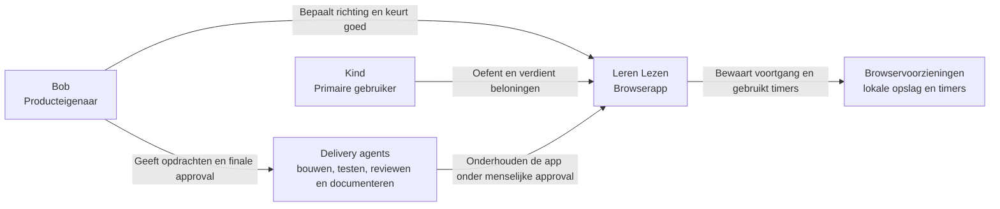
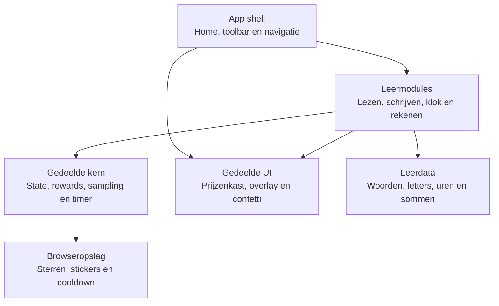
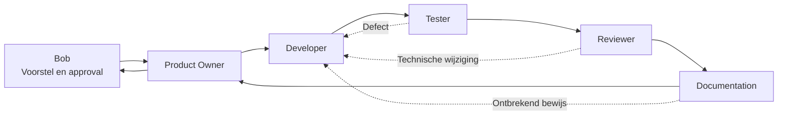

# Leren Lezen: Product- En Gebruikersgids

## Het Idee

Leren Lezen is een eenvoudige browserapp voor jonge kinderen. Een kind oefent
lezen, schrijven, klok kijken en rekenen in korte rondes. Goede antwoorden geven
sterren en streaks. Bij vaste steraantallen komen stickers in de prijzenkast.

De app werkt lokaal in de browser. Er is geen account of backend nodig. Sterren,
stickers en een eventuele pauzetijd worden in de browser opgeslagen.

## Wat Kun Je Doen?

| Module | Wat oefent het kind? | Wat gebeurt er? |
| --- | --- | --- |
| Leren lezen | Een woord bij een emoji herkennen | Kies een van vier woorden |
| Leren schrijven | Een eenvoudig woord opbouwen | Klik letters in de juiste volgorde en gebruik `⌫` om te wissen |
| Leren klok kijken | Hele uren herkennen | Bekijk de analoge klok en kies de juiste tijd |
| Leren rekenen | Optellen tot en met 10 | Bekijk de som en kies het juiste antwoord |
| Prijzenkast | Voortgang en motivatie | Verdiende stickers verschijnen bij 3, 7, 12, 20 en 30 sterren |

## Waar Klik Je?

1. Open de lokale of gehoste URL van de app.
2. Kies op Home een van de vier grote leerknoppen.
3. Klik of tik in de oefening op een woord, letter, tijd of antwoord.
4. Gebruik `← Home` of de terugknop van de browser om terug te gaan.
5. Gebruik `Reset` waar die knop zichtbaar is om de huidige voortgang opnieuw te
   starten. De schrijfmodus heeft momenteel geen eigen resetknop.
6. De knop `AAN`/`UIT` wisselt momenteel alleen de geluidsstatus. De oefeningen
   spreken nog geen tekst uit.

Na tien minuten spelen kan de app een pauze van vijftien minuten afdwingen. De
resterende pauzetijd verschijnt in een overlay.

## C4: Systeemcontext

Dit C4-contextdiagram laat zien wie het systeem gebruikt en welke
browservoorzieningen het gebruikt.

## C4: Containers En Modules

De app is een statische frontend. De "containers" hieronder zijn logische
onderdelen in dezelfde browserapp, geen losse servers.

## Hoe Agents Samenwerken

De agents leveren niet allemaal tegelijk werk af. De Orchestrator bewaakt een
vaste flow en Bob houdt de productbeslissingen en finale approval.

- **Orchestrator Agent** bewaakt buiten deze inhoudelijke lijn de workflowstate,
  budgetcontrole, vereiste artefacten en handoffs.
- **Product Owner Agent** zet de wens om in duidelijke acceptatiecriteria en
  controleert aan het eind of het productdoel is bereikt.
- **Developer Agent** bouwt de wijziging en meldt de documentatie-impact.
- **Tester Agent** controleert het zichtbare gedrag en regressies onafhankelijk.
- **Reviewer Agent** controleert codekwaliteit, architectuur en veiligheid.
- **Documentation Agent** controleert na iedere stabiele wijziging agentdocs,
  humandocs, visuals en flows. Ook `geen update nodig` moet worden gemotiveerd.
- **Bob** bepaalt productrichting en geeft expliciete toestemming voor merge.

De uitgebreide flow staat in `docs/agents/agent-collaboration.md` en
`ai-agents/workflows/feature-delivery-workflow.md`.

## Huidige Grenzen

- De app heeft geen gebruikersaccounts, backend of synchronisatie tussen apparaten.
- De leerinhoud staat als lokale data in de repository.
- Er bestaat een tekst-naar-spraakmodule, maar die is nog niet gekoppeld aan de
  oefeningen; de geluidsknop geeft daardoor nog geen hoorbare feedback.
- De huidige runtime is vanilla HTML, CSS en JavaScript. Angular staat alleen als
  voorbereidende migratierichting beschreven en is nog niet actief.
