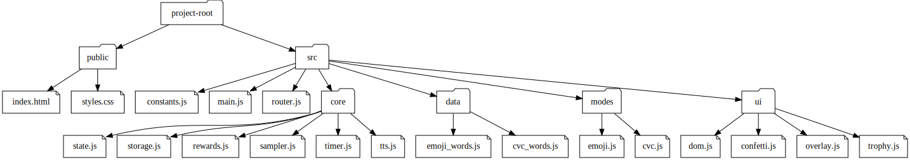

# Project Structure Documentation

This document describes the folder and file structure of the **Leren Lezen** project,
including an architecture diagram and explanations of each component.

---

## 📂 Folder Structure

```
project-root/
│
├── public/
│   ├── index.html
│   └── styles.css
│
├── src/
│   ├── constants.js
│   ├── main.js
│   ├── router.js
│   │
│   ├── core/
│   │   ├── state.js
│   │   ├── storage.js
│   │   ├── rewards.js
│   │   ├── sampler.js
│   │   ├── timer.js
│   │   └── tts.js
│   │
│   ├── data/
│   │   ├── emoji_words.js
│   │   └── cvc_words.js
│   │
│   ├── modes/
│   │   ├── emoji.js
│   │   └── cvc.js
│   │
│   └── ui/
│       ├── dom.js
│       ├── confetti.js
│       ├── overlay.js
│       └── trophy.js
```

---

## 🖼 Architecture Diagram



---

## 📖 Explanation

### **public/**
Contains static files served directly by the browser.
- **index.html** → main entry HTML file, loads `src/main.js`.
- **styles.css** → global styling, buttons, emoji sizes, trophies, animations.

### **src/**
Application logic and components.

- **constants.js**  
  Defines constants (timers, reward tiers, etc.).

- **main.js**  
  Entry point, initializes the app, sets up routing and UI.

- **router.js**  
  Manages navigation between screens (home, emoji, CVC).

---

### **src/core/**
Core business logic and state management.
- **state.js** → Central app state (stars, streak, stickers). Supports reset & pub/sub.
- **storage.js** → Persistence layer (localStorage).
- **rewards.js** → Reward system (stickers, thresholds).
- **sampler.js** → Random selection with no-repeat logic.
- **timer.js** → Session time limits and pause/cooldown system.
- **tts.js** → Text-to-speech for audio feedback.

---

### **src/data/**
Static datasets.
- **emoji_words.js** → Emoji → word pairs.
- **cvc_words.js** → Letters and simple words (CVC pattern).

---

### **src/modes/**
Game modes (learning exercises).
- **emoji.js** → Emoji & word matching game.
- **cvc.js** → Build-the-word (CVC) game.

---

### **src/ui/**
UI components and effects.
- **dom.js** → Helper functions (`$`, `el`) for DOM handling.
- **confetti.js** → 🎉 Celebration effect.
- **overlay.js** → Pause/cooldown overlay.
- **trophy.js** → Trophy case rendering, animations, next-sticker display.

---

## 🔄 Reset Functionality
- Implemented in `state.js` (`resetSession`).
- Already wired in **emoji.js** (`🔄 Reset` button).
- Needs to be added in **cvc.js** and optionally on **home screen**.

---

This document should be kept in `docs/PROJECT_STRUCTURE.md` and updated whenever new files or modules are added.
