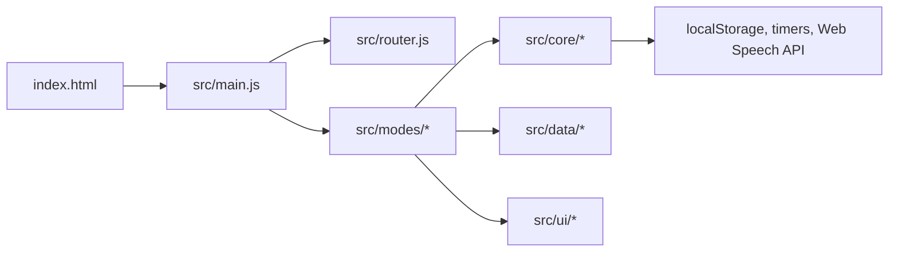

# Agent Handbook

## Snel Starten

Lees voor iedere taak in deze volgorde:

1. `AGENTS.md`
2. `ai/README.ai.md`
3. `ai/ai_instructions/ai-codex-instructions.md`
4. `ai/ai_instructions/CODE_QUALITY.md`
5. `ai/ai_instructions/CODE_SECURITY.md`
6. `docs/PROJECT_STRUCTURE.md`
7. `docs/DOCUMENTATION.md`
8. De definitie van je agent in `ai-agents/agents/`
9. De relevante workflow in `ai-agents/workflows/`

Meld bij handoff welke instructiebestanden daadwerkelijk zijn gebruikt. Wanneer
bronnen botsen, volg de meest specifieke actuele projectinstructie en maak het
conflict zichtbaar.

## Codebasekaart

| Pad | Betekenis |
| --- | --- |
| `index.html` | Root-entrypoint voor statische hosting |
| `public/styles.css` | Globale visuele stijl en responsive gedrag |
| `src/main.js` | Startup, home-toolbar en navigatiewiring |
| `src/router.js` | Wisselt tussen home en modeschermen |
| `src/modes/` | Functionele leeractiviteiten: emoji, CVC, klok en rekenen |
| `src/core/` | State, opslag, rewards, sampling, timer en tekst-naar-spraak |
| `src/data/` | Statische leerinhoud per modus |
| `src/ui/` | Gedeelde DOM-, overlay-, confetti- en prijzenkastfuncties |
| `scripts/` | Lokale en CI-controles, inclusief orchestration dry-run |
| `ai-agents/` | Agentrollen, shared skills en deliveryworkflows |
| `docs/` | Blijvende agent- en mensgerichte projectkennis |

Voor Angular-migratieonderzoek geldt aanvullend
`docs/ANGULAR_MIGRATION_PREPARATION.md`; dit beschrijft een voorstel en geen
actieve Angular-runtime.

## Functionele Afhankelijkheden

## Documenten En Artefacten

| Document | Gebruik |
| --- | --- |
| `docs/HUMAN_GUIDE.md` | Productidee, modules, klikroutes en C4-overzicht |
| `docs/PROJECT_STRUCTURE.md` | Bestandsstructuur en moduleverklaring |
| `docs/DOCUMENTATION.md` | Impactcheck en scheiding tussen doelgroepen |
| `docs/agents/agent-collaboration.md` | Compacte agent deliveryflow |
| `ai-agents/skills/shared-skills.md` | Dev Summary en Decision Record |
| `ai-agents/workflows/feature-delivery-workflow.md` | Volledige state machine |
| `ai-agents/workflows/github-orchestration-workflow.md` | GitHub-labels en events |

## Agentflow

1. Bob stelt een feature of correctie voor.
2. Orchestrator bewaakt state, budget, artefacten en handoffs.
3. Product Owner maakt het werk agent-ready.
4. Developer implementeert en levert testbewijs plus documentatie-impactindicatie.
5. Tester valideert gedrag; Reviewer valideert techniek en architectuur.
6. Documentation Agent voert de definitieve impactcheck uit en actualiseert
   agentdocs, humandocs, beide of motiveert `geen`.
7. Product Owner valideert product en documentatie.
8. Bob geeft expliciete approval; pas daarna kan merge worden aangevraagd.

Iedere handoff bevat minimaal een Dev Summary, huidige workflowstatus, relevante
artefacten, risico's en het volgende verantwoordelijke agentdoel.

## Documentatie Voor Iedere Wijziging

Gebruik `docs/DOCUMENTATION.md`. Noem bij handoff:

- impactuitkomst: `agent`, `human`, `beide` of `geen`;
- geraakte modules en zichtbaar gedrag;
- vermoedelijk verouderde documenten;
- gebruikte bewijsbronnen.

De Documentation Agent is eigenaar van de eindcontrole, maar iedere uitvoerende
agent blijft verantwoordelijk voor een bruikbare impactindicatie.
