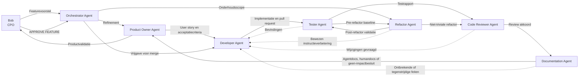

# Samenwerking tussen agents

Dit eenvoudige diagram toont de normale route van een feature door de agents.
De Orchestrator bewaakt de workflow en draagt het werk over; Bob geeft de
uiteindelijke goedkeuring.

## Rollen

- **Orchestrator Agent** bewaakt proces, status, budget en vereiste artefacten.
- **Product Owner Agent** verfijnt en valideert de feature.
- **Developer Agent** implementeert, test en verzorgt de pull request.
- **Refactor Agent** verbetert interne codekwaliteit zonder gedrag te wijzigen
  en koppelt terugkerende kwaliteitsproblemen terug naar de Developer Agent.
- **Tester Agent** controleert acceptatiecriteria en regressies.
- **Code Reviewer Agent** controleert kwaliteit, architectuur en veiligheid.
- **Documentation Agent** voert altijd de impactcheck uit en houdt agent- en
  mensgerichte documentatie als aparte informatielagen actueel.
- **Bob** bepaalt de productrichting en geeft expliciete goedkeuring.

De uitvoerbare Codex-definities staan in `.codex/agents/`. De herbruikbare
workflows die rollen expliciet kunnen activeren staan in `.agents/skills/`.
De Markdown-workflows onder `ai-agents/workflows/` blijven de uitgebreide
state-machinebron.

## Refactorroute

Refactorwerk gebruikt een afzonderlijke route:

1. De Tester Agent legt het bestaande gedrag en de relevante checks vast.
2. De Refactor Agent voert kleine, omkeerbare structurele wijzigingen uit.
3. De Tester Agent herhaalt de baseline en controleert regressies onafhankelijk.
4. De Reviewer Agent beoordeelt niet-triviale architectuur- en kwaliteitsimpact.
5. De Documentation Agent werkt navigatie, architectuur of agentinstructies bij.

De Refactor Agent mag de Developer Agent alleen bijwerken wanneer een probleem
terugkeert, aantoonbare impact heeft en kan worden vertaald naar een korte,
toetsbare regel die niet al in de bestaande instructies staat.

## Vaste documentatiestap

Na een non-blocking review krijgt de Documentation Agent de stabiele wijziging.
De uitkomst is altijd een van deze vier:

- `agent`: alleen instructies, codebase-navigatie of agentflow verandert.
- `human`: alleen productuitleg, klikroutes of functionele uitleg verandert.
- `beide`: beide doelgroepen worden geraakt.
- `geen`: geen update nodig, met een korte controleerbare motivatie.
