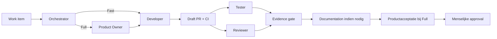

# Samenwerking Tussen Agents

Niet-normatief overzicht voor mensen. De actieve regels staan in de bronnen uit
`docs/agents/README.md`.

## Routes

Tester en Reviewer werken parallel op dezelfde head-SHA. Nieuwe commits maken
hun bewijs stale.
Voor dezelfde PR-SHA doorlopen Tester en Reviewer samen hoogstens drie
opeenvolgende verificatie- of reviewcycli. Als er daarna nog geen overeenstemming
of duidelijke non-blocking uitkomst is, escaleert de Orchestrator naar Bob in
plaats van een nieuwe lus te starten.

## Agentvergelijking

| Agent | Hoofdtaak | Standaardcontext | Schrijft |
| --- | --- | --- | --- |
| Orchestrator | route, state en handoffs | workflow + GitHub-state | workflowstatus |
| Product Owner | criteria en acceptatie | work item + productbron | productartefacten |
| Developer | implementatie | scope + gewijzigde modules | code en tests |
| Tester | gedragsbewijs | criteria + testscope | geen projectbestanden |
| Reviewer | technische review | PR-diff + risicobronnen | geen projectbestanden |
| Documentation | impact en uitleg | stabiele diff + docsbron | documentatie |
| Refactor | gedragsbehoudende structuur | baseline + relevante architectuur | begrensde code |

De model- en reasoningprofielen staan uitsluitend in `.codex/agents/*.toml`.

## Threads En Worktrees

- iedere gespecialiseerde rol gebruikt een afzonderlijke thread;
- het handoffpakket bevat alleen taakcontext en geselecteerde Context sources;
- schrijvende parallelle agents gebruiken aparte worktrees;
- timeout- en retryregels komen uitsluitend uit `$budget-control`;
- technisch agentbewijs vervangt geen menselijke approval.
